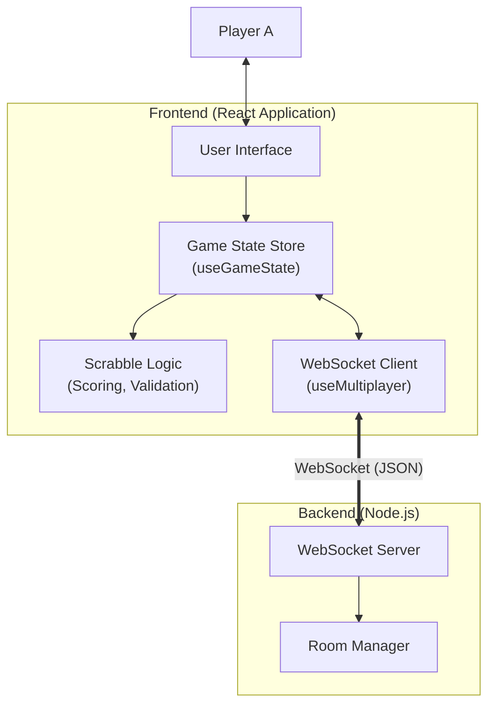

# 🇧🇬 BG Scrabble (Скрабъл)

I coudn't find a bulgarian scrable so here is one. It uses web sockets for the connection and a prefiltered list of words which acts as the bulgarian dictionary (with around 730k entries)


---

## Architecture Overview

This application uses a **Client-Heavy** architecture where the game logic resides almost entirely in the browser. The server acts as a lightweight message relay.



### 1. Frontend Stack
-  React 19, TypeScript, Vite, TailwindCSS.

### 2. Backend Stack
-  Node.js, `ws` library.

---

## Project Structure

- **`src/components/`**: UI components (GameBoard, TileRack, Scoreboard).
- **`src/hooks/`**: Custom hooks for logic separation.
  - `useGameState.ts`: The core "Redux-like" state machine.
  - `useMultiplayer.ts`: Handles WebSocket connection and events.
  - `useWordValidator.ts`: dictionary validation logic.
- **`server/`**: The Node.js WebSocket server entry point.

---

## To start: 

### Prerequisites
- Node.js (v18+)
- npm

### Installation
```bash
npm install
```

### Running Locally

**Terminal 1 (Frontend)**
```bash
npm run dev
# Runs on http://localhost:5173
```

**Terminal 2 (Backend)**
```bash
npm run server
# Runs on ws://localhost:3001
```

